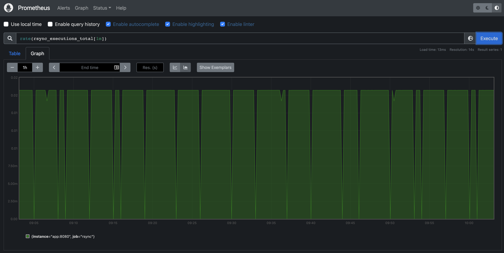

# Rsyncd logfile exporter

# I. Overview
This is a Logfile exporter project having as a goal to (i) collect metrics by analyzing logs being generated by an `rsyncd` 
server and (ii) store them in a Prometheus server for its future monitoring and visualization.

# 1. Entry Point ( ```main.py``` )
The execution of the exporter begins by triggering such an action with ``` python3 analyzer.py ```, however, notice 
that a command line tool to analyze the content of log files was implemented, therefore some arguments must be included
its usage is describes here below:

* Usage: ``` main.py [-h] -p PATH_TO_LOG_FILE [-f PATH_TO_LOG_FORMAT] [-s SECONDS] [-x PROMETHEUS_PORT] ```

    * ``` -p ``` Path to log file (Mandatory)
    * ``` -f ``` Path to log format
    * ``` -s ``` Time in seconds to check for new content in the log file
    * ``` -x ``` Port in which a WSGI server starts for prometheus metrics

#### Considerations:

1. I implemented the solution as a command line tool for scalability purposes. It allows flexibility to the user
depending on their needs, since some values can be manually defined (e.g., port) and eventually if more features 
are included new parameters can be annexed accordingly.
2. When considering the inclusion of the ``` -f ``` feature, I was thinking about future log formats. This idea is
based on how [Fluentd](https://docs.fluentd.org/filter/parser) parses different types of logs. For this exercise I 
was considering a simple file having `rsyncd` log format in the first line (See ```format.txt``` file)

# 2. Exporter ( ``` Exporter.py``` )

After the creation of an Exporter object given the arguments provided by the user in the command line, 
I am triggering the method ```collect_metrics()``` in which I am (i) defining the metrics I want to collect, 
(ii) starting the http server, and (iii) reading the living log file (See ```rsync.log``` file)

#### Considerations:

1. I defined 6 Counters since is a cumulative metric that represents a single monotonically increasing counter
whose value can only increase. That would be the case for (i) number of connections, (ii) number of executions,
(iii) total of errors, and (iv) total of received, sent and exchanged bytes. Notices that for the metric related to the 
errors, I included a label (i.e., ```["status_code"]```) since several [errors](https://linux.die.net/man/1/rsync) 
could occur during the execution, therefore for traceability purposes and a better understanding of the behaviour of the application
the information can help during troubleshooting activities.

2. While reading the living log file I implemented such a feature with ```yield``` having in mind 
that a generator function can be memory efficient since the results it produces are calculated as needed.

# 2. Parser ( ``` Parser.py``` )

This will parse a log given a format that has been provided, if such a pattern is not provided the in its initialized with 
a default pattern. 

#### Considerations:
1. I implemented the parser with regular expressions, I used named groups in order to capture groups, 
and additionally associate to them a name.
2. **Future work:** Despite the fact I was thinking about a ```format.txt``` file to provide more flexibility, more work should be done
within the ```collect_metrics()``` method since it is currently extracting some information based on the structure of the value
for the ```description``` key inside the dictionary that is being created by the parser.

---

# II. Packaging 

I wrote a ```docker-compose``` file to run the ```rsyncd``` exporter and Prometheus server as docker containers, moreover 
I wrote a ```Dockerfile``` to build a Docker image with ```rsyncd``` exporter.

# 1. Docker file (```Dockerfile```)
 In this docker file I am defining the following tasks:

1. Updating and installing dependencies
2. Creating directories and defining the working directory
3. Copying files such as source code, log file, and formats
4. Defining some **execute** permissions
5. Adding Cronjob into the cron table
6. Exposing the ```8080``` port
7. Defining ```start_rsync_pipeline.sh``` as our entry point 

#### Considerations:
1. In the ```start_rsync_pipeline.sh``` I am (i) starting the ```rsync``` service with the configuration defined in 
```rsyncd_example.conf```, (ii) starting the daemon to execute scheduled commands (See ```cron_task```), and (iii)
starting the exporter with ```python3 main.py -p rsync.log```, ```-p``` is required.
2. I have defined a task to be executed every minute (See ```cron_task```) in order to generate new logs, 
it executes the script in ```generate_logs.sh``` which triggers the command ```rsync -rav rsync://localhost:8737/exercise/ tmp/```. 

# 2. Docker compose (```docker-compose.yml```)

In this file I am defining the construction of the containers, the first one will be built depending on the ```Dockerfile``` and
binding the ```8080``` port, the second one regarding ```Prometheus``` will employ the port ```9090``` and will use as a configuration
the information defined in ```prometheus.yml```

### Considerations: 
1. We should define the target as follows ```targets: ['app:8080']``` since we have defined the ```app``` service in the 
``docker-compose.yml`` with that label.

---


# II. Execution

Once we are in the root folder we should run the command ```docker-compose up``` and it will generate the two containers
based on the information within the ```docker-compose.yml``` file.

Testing the complete solution can be done by visiting Prometheus web UI and executing desired PromQL queries. 
One could have access on ```http://localhost:9090/graph``` and after several minutes generating logs, one could start
running queries such as: ```rate(rsync_executions_total[1m])``` and visualize the results as follows: 




